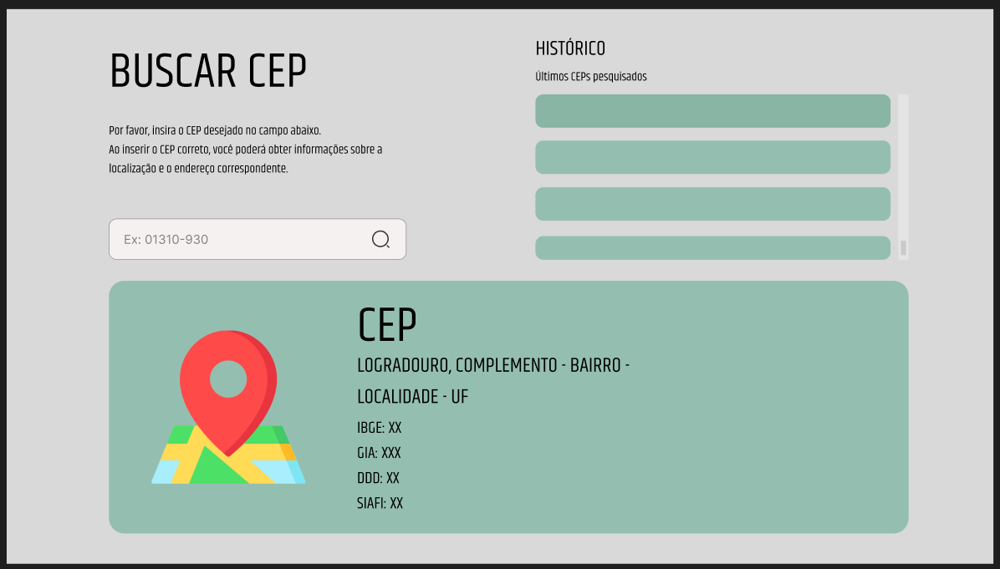
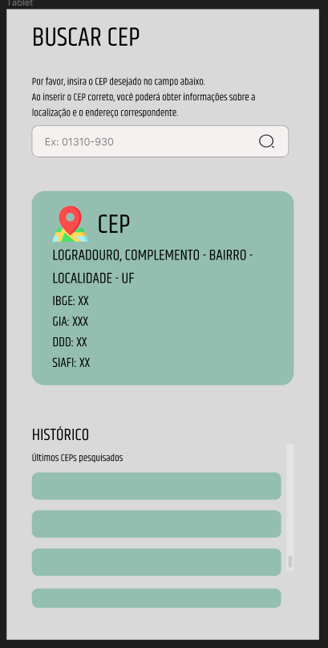

# CEP Search

## Table of Contents

- [Introduction](#introduction)
- [Features](#features)
- [How to Use](#how-to-use)
- [License](#license)
- [Credits and Acknowledgments](#credits-and-acknowledgments)
- [Contact](#contact)

## Introduction

Project developed to study frontend, using typescrip, react and the MUI library.
Layout made using Figma:

## Features

- Display information about the zip code searched.

## How to Use

To set up and run the project, follow these steps:

### Prerequisites

You need to install the following tools:

- [Node.js](https://nodejs.org/)
- [npm](https://www.npmjs.com/) ou [Yarn](https://yarnpkg.com/)

### Installation

1. Clone this repository: `git clone https://github.com/eri-oliveira/cep-search.git`
2. Navigate to the cloned project folder.
3. Install project dependencies using **npm** (npm install) or **Yarn** (yarn install)

### Running the Project

Initialize the Vite development server:

- Using **npm**: npm run dev
- Using **yarn**: yarn dev

After running the command, the server will start. You can access the application in your web browser by visiting the localhost address displayed in the terminal.

## License

This project is licensed under the MIT License - see the [LICENSE](LICENSE) file for details.

## Credits and Acknowledgments

I would like to thank [**ViaCEP**](https://viacep.com.br/) for providing the API free of charge.

## Contact

Email 💌: `eoliveiradev@proton.me`
